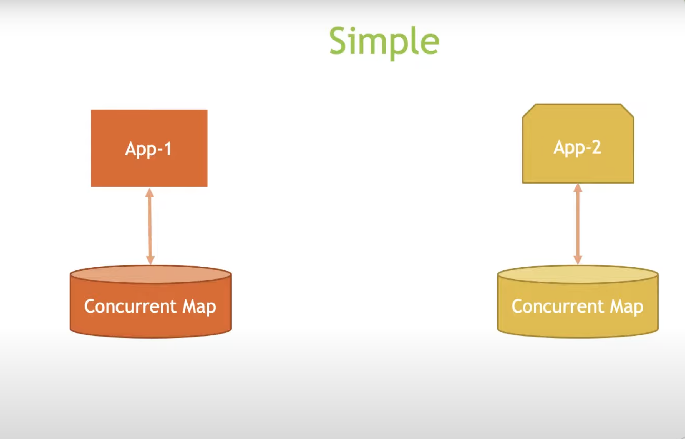

## Spring Cache Under the Hood
## Spring Cache Under the Hood – Non-Distributed Cache Example

The image presents two separate Spring-based applications, each utilizing the default caching mechanism provided by Spring. Here's an updated breakdown of the caching process considering each application has its own cache:

1. **Cache Abstraction**: Spring's cache abstraction allows developers to apply caching to their applications without delving into the actual caching details. This abstraction layer supports different caching solutions and simplifies their integration.

2. **@Cacheable Annotation**: Methods annotated with `@Cacheable` enable Spring to manage caching behind the scenes. If a result for the given method call is absent in the cache, the method is executed and its result is stored for future use.

3. **ConcurrentMapCacheManager**: By default, Spring configures a `ConcurrentMapCacheManager` if no other cache manager is defined. This manager backs the cache with an in-memory `ConcurrentHashMap`.

4. **Independent Caches**: Each application instance, such as `App-1` and `App-2`, operates with its own instance of `ConcurrentMapCacheManager`. This means the caches are local to each application and are not shared or distributed.

5. **Cache Operations**: When `App-1` calls a `@Cacheable` method, it checks its local `ConcurrentHashMap` for a cached result. If the result is not found (cache miss), the method is executed, and the result is cached. `App-2`, when calling the same method, will not benefit from `App-1`'s cached result and will have to execute the method and cache its result locally.

6. **Cache Isolation**: This demonstrates that the default cache configuration is isolated per application. Each application's cache is independent, leading to separate caches that do not share data. This isolation ensures that cache access is local and fast but also means that data is not shared across different instances.

7. **Cache Eviction and Conditions**: The cache's behavior can still be managed using annotations like `@CacheEvict` to remove entries and `@CachePut` to update the cache under certain conditions.

8. **Consistency Challenges**: With each application instance having its own cache, a key challenge that arises is maintaining consistency between these independent caches. 
If `App-1` updates a value in its local cache, `App-2` remains unaware of this change. As a result, `App-2` may continue to read stale data from its cache, leading to consistency issues across the applications. 
This scenario is particularly problematic in environments where multiple instances of the same application need to have synchronized data views.

9. **Cache Eviction Non-Propagated**: When an application instance invokes a cache eviction operation, such as `@CacheEvict`, it only affects its local cache. 
For instance, if `App-1` performs a cache eviction to refresh the data, this operation does not propagate to `App-2`. Consequently, `App-2` will continue serving data from its cache, which might now be outdated compared to `App-1`. 
This lack of propagation exacerbates the consistency issues and can lead to discrepancies in the data presented to the users or used by the applications.

To address these issues, one would typically implement a distributed cache solution where cache operations are synchronized across all application instances. 
This ensures that all instances share the same state and that actions like cache eviction have a system-wide effect, maintaining data consistency and integrity.

While the default cache store is easy to set up and effective for individual applications, it's not suitable for distributed scenarios where cache sharing or synchronization across multiple instances is required. 
In such cases, a distributed caching solution like **Redis** or **Hazelcast** would be appropriate.
